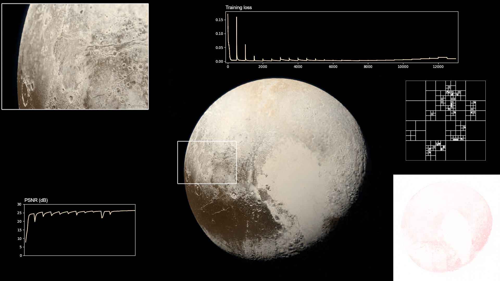

ReACORN
=======

This is an attempt at reproducing the results from the ACORN paper:

*J. N. P. Martel\*, D. B. Lindell\*, C. Z. Lin, E. R. Chan, M. Monteiro, G. Wetzstein, [ACORN: Adaptive Coordinate Networks for Neural Representation](https://arxiv.org/abs/2105.02788) (SIGGRAPH), 2021* [[project page](https://www.computationalimaging.org/publications/acorn/)]

[](https://perso.telecom-paris.fr/emichel/share/pluto.mp4)  
*(click to see it animated)*

**NB** As one can see in the image above, this repository is not producing the expected accuracy yet.

Dependencies
------------

This implementation is based on [PyTorch](https://pytorch.org/) for tensor operations. It uses [pulp](https://coin-or.github.io/pulp/) to optimize the quad tree. It also uses `numpy` and `matplotlib` for I/O and plotting. All of these can be set up using the `requirements.txt` file:

    pip install -r requirements.txt

Reproducing
-----------

**Pluto**

To reproduce the results on the Pluto image, the main entry point is `pluto_train.sh`. It is advised to run the lines from this file manually. It first downloads the pluto image and scales it to 4096 pixels. Then it calls `acorn_train.py` with the options described in the first appendix of the paper. Finally it shows an example of call to `acorn_eval_image.py`.

The `pluto_gen_stats.py` file was used to generate the video above but it requires that you save all intermediary checkpoints using `--end_checkpoint checkpoints/pluto/pluto.######.tar`.

**Other**

Since the Pluto example is not working well enough yet (it hardly reaches 25dB where the original paper reaches 30dB in 30s), other examples have not been explored so far.

Project layout
--------------

All top level scripts are command that can be called from command line, run them with `--help` as argument or have a look at the beginning of the files to know more about their arguments.

The core implementation is provided in the `acorn` module. The implementation is mostly agnostic in the dimension of the input domain (2D, 3D) and of the output signal (RGB, RGBA, SDF, etc.), but only the 2D version has really been tested so far. 3D will be explored only once reasonable enough results will be reached on the Pluto example.

All files are more-than-average commented (for what it means), so feel free to walk through them!

Contributing
------------

Your help is very welcome to read over and try to figure out what makes this implementation not as good as the original! Fill free to open [new issues](https://github.com/eliemichel/ReACORN/issues/new).

License
-------

This project is released under the terms of the MIT license:

```
Copyright (c) 2021 -- Télécom Paris (Élie Michel <elie.michel@telecom-paris.fr>)

Permission is hereby granted, free of charge, to any person obtaining a copy
of this software and associated documentation files (the “Software”), to
deal in the Software without restriction, including without limitation the
rights to use, copy, modify, merge, publish, distribute, sublicense, and/or
sell copies of the Software, and to permit persons to whom the Software is
furnished to do so, subject to the following conditions:

The above copyright notice and this permission notice shall be included in
all copies or substantial portions of the Software.

The Software is provided “as is”, without warranty of any kind, express or
implied, including but not limited to the warranties of merchantability,
fitness for a particular purpose and non-infringement. In no event shall the
authors or copyright holders be liable for any claim, damages or other
liability, whether in an action of contract, tort or otherwise, arising
from, out of or in connection with the software or the use or other dealings
in the Software.
```
